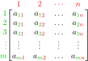

Matrix image courtesy of [mavaddat](https://commons.wikimedia.org/wiki/File:MatrixLabelled.svg).

In now-merged [PR 8603](https://github.com/FreeCAD/FreeCAD/pull/8603) new FreeCAD contributor [Daniel-Khodabakhsh](https://github.com/Daniel-Khodabakhsh) developed a new set of matrix-construction convenience functions that are provide a much nicer API than the original matrix creation methods.

The following functions were added which are shorthand for the `create` function:


| New function | Object type | Analog |
| --- | --- | --- |
| `matrix(...)` | `Matrix` | `create(<<matrix>>; ...)` |
| `placement(...)` | `Placement` | `create(<<placement>>; ...)` |
| `rotation(...)` | `Rotation` | `create(<<rotation>>; ...)` |
| `rotationx(angle)` | `Rotation` | `create(<<rotation>>; create(<<vector>>; 1; 0; 0); angle)` |
| `rotationy(angle)` | `Rotation` | `create(<<rotation>>; create(<<vector>>; 0; 1; 0); angle)` |
| `rotationz(angle)` | `Rotation` | `create(<<rotation>>; create(<<vector>>; 0; 0; 1); angle)` |
| `translationm(x; y; z)` | `Matrix` | `create(<<matrix>>; 1; 0; 0; x; 0; 1; 0; y; 0; 0; 1; z; 0; 0; 0; 1)` |
| `vector(...)` | `Vector` | `create(<<vector>>; ...)` |

The following matrix functions were also added. These functions are following the same pattern previously established by the existing `minvert` and `mscale`.


| New function | Description |
| --- | --- |
| `mrotate` | Rotate given object. |
| `mrotatex` | Rotate given object around the X-axis. |
| `mrotatey` | Rotate given object around the Y-axis. |
| `mrotatez` | Rotate given object around the Z-axis. |
| `mtranslate` | Translate given object (`Rotation` objects will be returned as a `Placement` object) |


These functions return the same type of object which was supplied with the exception of `mtranslate`.

The functions can be chained together like so:

```
=mtranslate(mrotatex(placement(vector(1; 2; 3); rotation(0; 0; 0)); 45); 1; 2; 3)
```

Thanks to Daniel-Khodabakhsh for this valuable contribution to FreeCAD`s Expression API.