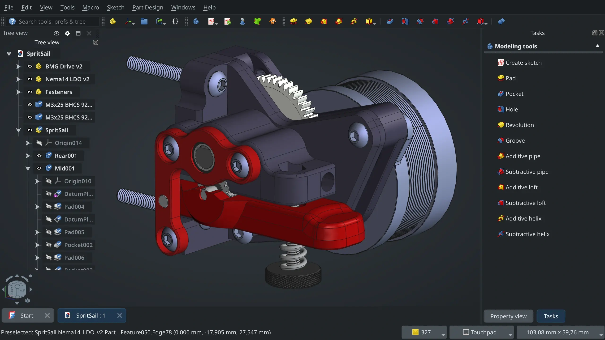

After more than twenty years of intense and sustained development, the FreeCAD community is proud to announce the release of version 1.0. FreeCAD 1.0 is now [available for download on all platforms](https://www.freecad.org/downloads.php).



In software development, version 1 usually means: our software is now stable and ready for "real work". If you are a FreeCAD user, you know that FreeCAD has been ready for real work for years, and is used in productive, professional activity all over the world already. We in fact were tempted many times in the past to cut to the chase, and call the next version 1.0 already!

But we didn't. Since the very beginnings, the FreeCAD community had a clear view of what 1.0 represented for us. What we wanted in it. FreeCAD matured over the years, and that list narrowed down to just two major remaining pieces: fixing the toponaming problem, and having a built-in assembly module.

Well, I'm very proud to say those two issues are now solved. Not finished, mind you, not the perfect, bug-free, faultless features we all want, but reaching that level takes time and effort. That will be our job from now on. What we have now is a solid, working, reliable toponaming solution, that is already in action in the Sketcher and PartDesign, and is being progressively extended to everything else. And we have a good and fairly complete assembly workbench that has a shiny new solver that comes, if you can believe it, from "the other FreeCAD". Read the full [release notes](https://wiki.freecad.org/Release_notes_1.0) to learn more about all this.

This version 1.0 is not a finished product, simply because FreeCAD is not a product. It's our project, our baby, our passion, our tool. Version 1.0 is our achievement. All of us who worked on it, from the ones who helped raise the project on its feet and are not participating anymore to people who just came to help finishing translations for this release, we worked hard for this, we deserved this, and this 1.0 means: we've done it.

I hope you'll enjoy using this new version! If this is your first contact with FreeCAD, be sure to check the [documentation](https://wiki.freecad.org/Main_Page), the [manual](https://wiki.freecad.org/Manual:Introduction), the [tutorials](https://wiki.freecad.org/Tutorials) and everything the community has prepared to help you get started! ~ Yorik

With the release of version 1.0 we wanted to provide an executive summary as a quicker read of the Version 1.0 release notes. The full Version 1.0 release notes are available on the [FreeCAD Wiki](https://wiki.freecad.org/Release_notes_1.0), and a nice, [illustrated blog post](https://librearts.org/2024/11/freecad-1-0/) written by Alex.

Highlights:

- Following a long development process, Realthunders Topological naming problem mitigation algorithm has been incorporated into FreeCAD Version 1.0. This algorithm offers resiliency against topology changes in a parametric chain and a vast improvement of a model's stability.

- FreeCAD has a new included Assembly workbench which uses the brand-new Ondsel solver.

- A new logo was chosen by the community members, from community contributed proposals.

- The user interface has received huge improvements.These include rotational centre indicators, selection item filters, on-model task panel and combo view modes, universal measuring tools, brand-new dark and light themes and much more.

Other key improvements:

- There are multiple changes and improvements to the Core system. The vector API can now be used in expressions, the new property container _App::VarSet _allows the user to create design variations, along with many more improvements to the Python editor and Python API.

- A new, streamlined and faster start page replaces the Start Workbench.

- The Arch workbench has been merged with BIM and is now the BIM workbench with lots of new features and improvements added including native support for IFC documents.

- The Path workbench has been renamed the CAM workbench with lots of new features including a new CAM simulator.

- The Draft workbench has a long list of improvements. Grid behaviour has been optimised and appearance options have been increased with many of the Draft workbench tools and approaches receiving extra functionality.

- The FEM workbench has had a large overhaul with many small but useful changes to tools and functions. The language used on the FEM workbench has been developed to be closer to industrial standard terms.

- The material handling system has been completely overhauled and a standard system is now in place for further development.

- The Part workbench has numerous improvements with the Part Scale and Part Mirror tools being two obvious improved tools.

- The Part Design workbench has received many fixes and additional functionality within the revolution and groove features, as well as significant changes to the Pad tool making it possible to end extrusions at multiple faces and more.

- The Sketcher workbench has a huge amount of changes and increased functionality and UI improvements. These include "dimensioning on the go", contextual Dimension constraint tools, a new Offset tool and more. Cut and Paste including constraints is now available within and across sketches.

- The TechDraw workbench has numerous new tools: Snapping, a CosmeticCircle tool, an AddOffsetVertex tool and many others.